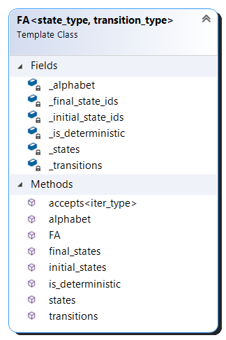
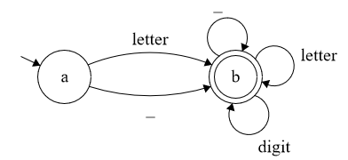
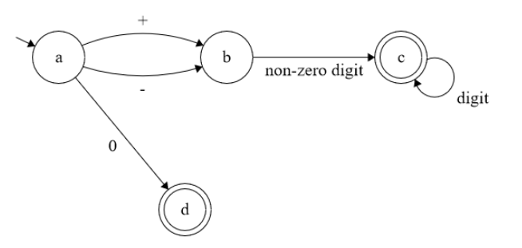

# FLCDFiniteAutomaton

This project contains an implementation of a finite automaton class, as well as a program that uses it.

# Requirement
Write a program that:
1. Reads the elements of a FA (from file)
2. Displays the elements of a finite automata, using a menu: the set of states, the alphabet, all the transitions, the set of final states.
3. For a DFA, verify if a sequence is accepted by the FA.

# Design

## The FA (Finite Automaton) Class
The class is defined in [FA.hpp](FA.hpp).


### Methods:
- Constructor:
	```C++ 
	FA(const std::vector<std::tuple<state_type, transition_type, state_type>>& transitions, 
	const std::unordered_set<state_type>& initial_states, const std::unordered_set<state_type>& final_states);
	```
	Parameters:
	- `transitions` contains tuples of <start_state, symbol_from_alphabet, end_state> that will become the possible transitions of the automaton
	- `initial_states` is the set of initial states
	- `final_states` is the set of final states
- `bool is_deterministic() const` returns true if the finite automaton is deterministic
- `bool accepts(iter_type begin, iter_type end) const` checks whether or not the automaton accepts a sequence; throws a runtime_error if the automaton is not deterministic
Parameters:
	- `begin` read-only iterator to the beginning of the sequence to check
	- `end` read-only iterator to the end (exclusively) of the sequence to check
- Various getters for each of the finite automaton's elements: initial/final/all states, alphabet, transitions
## The Program
[main.cpp](main.cpp)

This is a simple menu for working with finite automatons where states, as well as transitions, are `char`s.
It supports reading such automatons from files; the format of such a file is as such ([EBNF](https://en.wikipedia.org/wiki/Extended_Backus%E2%80%93Naur_form)):
```EBNF
input_file ::= initial_states transitions final_states
initial_states ::= state newline {state newline}
transitions ::= {state transition state}
final_states ::= state newline {state newline}
state ::= (* ASCII character except newline *)
transition ::= (* ASCII character except newline *)
newline ::= '\n'
```
The program also supports checking a string against the automaton, as well as querying its elements.
Two included input files, [`identifier.in`](identifier.in) and [`int_const.in`](int_const.in) represent automatons for checking if a string is an identifier, and an integer constant, respectively.

This is the shape of the automaton described in [`identifier.in`](identifier.in):



And this is the automaton from [`int_const.in`](int_const.in):



# Test Examples

- Using the automaton from [`identifier.in`](identifier.in), string `0id` is not accepted, while `id`, `id123`, `id_123`, `_` are accepted.
- Using the automaton from [`int_const.in`](int_const.in), strings `1`, `02`, `+0` are not accepted, while `0`, `-1`, `+23` are accepted.